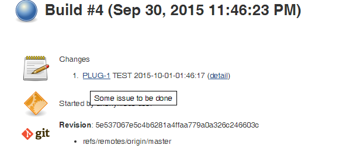
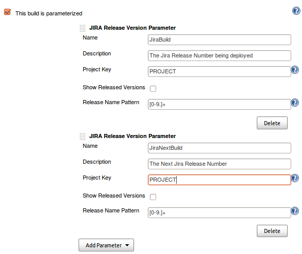
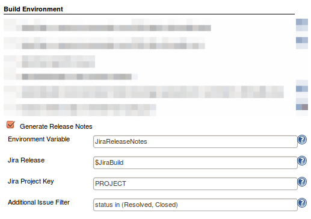

Jenkins Jira Plugin
===================

[](https://plugins.jenkins.io/jira)
[](https://github.com/jenkinsci/jira-plugin/releases/latest)
[](https://ci.jenkins.io/blue/organizations/jenkins/Plugins%2Fjira-plugin/activity/)
[](https://travis-ci.org/jenkinsci/jira-plugin)

[](https://stats.jenkins.io/pluginversions/jira.html)
[](https://coveralls.io/github/jenkinsci/jira-plugin?branch=master)
[](https://sonarcloud.io/dashboard?id=jenkins-jira-plugin)
[](https://github.com/jenkinsci/jira-plugin/graphs/contributors)


#### About the plugin

This plugin integrates with Jenkins the [Atlassian Jira Software](http://www.atlassian.com/software/jira/) (both Cloud and Server versions).

#### Usage with Jira Cloud

With Atlassian Jira Cloud, it's not possible to create a user without an
email, so you need to create API token that will be used as a _service user_
by Jenkins to execute API calls to Jira Cloud - follow [Atlassian API tokens documentation](https://confluence.atlassian.com/cloud/api-tokens-938839638.html)

Then create a global Jenkins credential:
- put *Atlassian ID email* as username
- *API token* as password.

You can check if your API token works correctly by getting a correct
JSON issue response with this command (where TEST-1 is an example issue
in your project):

```bash
$ curl -X GET -u <email>:<API token> -H "Content-Type: application/json"  https://<YourCloudInstanceName>.atlassian.net/rest/api/latest/issue/TEST-1
```

Also make sure that CAPTCHA is not triggered for your user as this will
prevent the API token to work - see [CAPTCHA section in Atlassian REST API documentation.](https://developer.atlassian.com/cloud/jira/platform/jira-rest-api-basic-authentication/)


#### Using Jira REST API

This plugin has an optional feature to update Jira issues with a back
pointer to Jenkins build pages. This allows the submitter and watchers
to quickly find out which build they need to pick up to get the fix.


#### Jira Issue links in build Changelog

When you configure your Jira site in Jenkins, the plugin will
automatically hyperlink all matching issue names to Jira.

If you have additionally provided username/password to Jira, the
hyperlinks will also contain tooltips with the issue summary.



#### Updating Jira issues with back pointers

If you also want to use this feature, you need to supply a valid user
id/password. If you need the comment only to be visible to a certain
Jira group, e.g. *Software Development*, enter the groupname. 

Now you also need to configure jobs. I figured you might not always have
write access to the Jira (say you have a Jenkins build for one of the
Apache commons project that you depend on), so that's why this is
optional.  

And the following screen shows how Jira issue is updated:


By taking advantages of Jenkins'
[fingerprint](https://wiki.jenkins.io/display/JENKINS/Fingerprint)
feature, when your other projects that depend on this project pick up a
build with a fix, those build numbers can also be recorded in Jira.

This is quite handy when a bug is fixed in one of the libraries, yet the
submitter wants a fix in a different project. This happens often in my
work, where a bug is reported against JAX-WS but the fix is in JAXB. 

For curious mind, see [this thread for how this works behind the scene](http://jenkins.361315.n4.nabble.com/How-can-does-Hudson-Jira-integration-works-td374680.html).

#### Referencing Jira Release version 

To reference Jira Release versions in your build, you can pull these
releases directly from Jira by adding the Jira Release Version
Parameter. 

This can be useful for generating release notes, trigerring
parameterized build, etc.  


#### Generating Release Notes

You can also generate release notes to be used during your build. These
notes can be retrieved from an environment variable. See the [Maven Project Plugin](https://wiki.jenkins.io/display/JENKINS/Maven+Project+Plugin) for
the environment variables found within the POM.  


After your build has run, you can also have the plugin mark a release as
resolved. This typically will be a release you specified in your Build
Parameters.  


The plugin can also move certain issues matching a JQL query to a new
release version.  


Sample usage of generated Release Notes:


#### Jira Authentication & Permissions required

**Note:** As a rule of thumb, **you should be always using a service
account** (instead of a personal account) to integrate Jenkins with
Jira.

Make sure that the Jira user used by Jenkins has enough permissions to
execute its actions. You can do that via Jira Permission Helper tool.

-   For creating Jira issues, the user has to be able to Create Issues
    in the specified project
-   If you additionally enter assignee or component field values, make
    sure that:
    -   both of the fields are assigned to the corresponding Jira Screen
    -   the Jira user is Assignable in the project
    -   the Jenkins Jira user can Assign issues


#### System properties

| Property Name                                                   | Functionality Change                                                                                  |
|-----------------------------------------------------------------|-------------------------------------------------------------------------------------------------------|
| **-Dhudson.plugins.jira.JiraMailAddressResolver.disabled=true** | Use to disable resolving user email from Jira usernames. Currently there is no option for this in UI. |

#### Related Resources

-   Check also the Marvelution [Jenkins Integration for Jira](https://www.marvelution.com/products/jenkins-integration-for-jira/) which provides a two-way solution (Jenkins-\>Jira and Jira-\>Jenkins)
-   For Jira Workflow (Pipeline) plugin compatibility see [COMPATIBILITY.md](COMPATIBILITY.md)

#### Releases

See [CHANGELOG.md](CHANGELOG.md)

Reported Issues:
* Next Release:
[[ToDo]](https://issues.jenkins-ci.org/issues/?filter=14997)
[[Done]](https://issues.jenkins-ci.org/issues/?filter=14998)
* Bugs: [[All]](https://issues.jenkins-ci.org/issues/?filter=14761) [[Confirmed]](https://issues.jenkins-ci.org/issues/?filter=14996)
* Other: [[All Non-Bugs]](https://issues.jenkins-ci.org/issues/?filter=14762)
[[All Unresolved]](https://issues.jenkins-ci.org/issues/?filter=14956)
* Categorized:
[[by Votes]](https://issues.jenkins-ci.org/issues/?filter=15156)
[[by Priority]](https://issues.jenkins-ci.org/issues/?filter=15157)

### Common issues

#### Jenkins<>Jira SSL connectivity problems

If you encounter stacktraces like this:
```
Caused by: javax.net.ssl.SSLHandshakeException: sun.security.validator.ValidatorException: PKIX path building failed: sun.security.provider.certpath.SunCertPathBuilderException: unable to find valid certification path to requested target
```

make sure the JRE/JDK that Jenkins master is running (or the Jenkins slaves are running) contain the valid CA chain certificates that Jira is running with.
You can test it using this [SSLPoke.java class](https://gist.github.com/warden/e4ef13ea60f24d458405613be4ddbc51)

like this:
```
$ wget -O SSLPoke.java https://gist.githubusercontent.com/warden/e4ef13ea60f24d458405613be4ddbc51/raw/7f258a30be4ddea7b67239b40ae305f6a2e98e0a/SSLPoke.java

$ /usr/java/jdk1.8.0_131/bin/javac SSLPoke.java

$ /usr/java/jdk1.8.0_131/jre/bin/java SSLPoke jira.domain.com 443
Successfully connected
```

References:
* [Jenkins fails with PKIX Path building error](https://stackoverflow.com/questions/52842214/jenkins-fails-with-pkix-path-building-error)
* [PKIX path building failed error message
](https://support.cloudbees.com/hc/en-us/articles/217078498-PKIX-path-building-failed-error-message)

### Contributing to the Plugin

New feature proposals and bug fix proposals should be submitted as [GitHub pull requests](https://help.github.com/articles/creating-a-pull-request).

Fork the repository on GitHub, prepare your change on your forked copy, and submit a pull request (see [here](https://github.com/jenkinsci/jira-plugin/pulls) for open pull requests).

Before submitting your change please note that:
* tests should be added for any changed code - the coverage is automatically checked after submitting the Pull Request
* the code formatting should follow the defined standard - see [Code Style](#code-style)
* you use findbugs to see if you haven't introduced any new warnings
* when adding new features please make sure that they support Jenkins Pipeline Plugin - see [COMPATIBILITY.md](https://github.com/jenkinsci/pipeline-plugin/blob/master/COMPATIBILITY.md) for more information

There have been many developers involved in the git plugin and there are many, many users who depend on the git-plugin.  

Tests help us assure that we're delivering a reliable plugin, and that we've communicated our intent to other developers in a way that they can detect when they run tests.

#### Code Style

We try to improve the code quality by conforming to
[Google Java styleguide](https://google.github.io/styleguide/javaguide.html), that is defined in 
[google_checks.xml](https://raw.githubusercontent.com/checkstyle/checkstyle/master/src/main/resources/google_checks.xml).
If you are using an IDE, like IntelliJ IDEA, please:

- install [Google Java Format plugin](https://plugins.jetbrains.com/plugin/8527-google-java-format)

or 

- install the [Checkstyle plugin](https://plugins.jetbrains.com/plugin/1065-checkstyle-idea)
- go to **Preferences > Editor > Code Style > Java**, select **Scheme** to *Project*
- click the Cog icon and import Checkstyle configuration from [google_checks.xml](https://raw.githubusercontent.com/checkstyle/checkstyle/master/src/main/resources/google_checks.xml)

Currently the formatting is not automatically checked during the build. However, in the effort to 
improve the quality of the code,  maintainers might ask for proper formatting during the review 
process, so it is better to have it in place sooner than later.

#### Building plugin with Docker

Build the plugin locally using Docker and Maven image version 3.3 & newest JDK 8:

    docker run -it --rm -v "$PWD":/usr/src/mymaven -v "$HOME/.m2:/usr/src/mymaven/.m2" -w /usr/src/mymaven maven:3.3-jdk-8 mvn clean package

#### Atlassian sources import

To resolve some binary compatibility issues [JENKINS-48357](https://issues.jenkins-ci.org/browse/JENKINS-48357),
the sources from the artifact [com.atlassian.httpclient:atlassian-httpclient-plugin:0.23](https://packages.atlassian.com/maven-external/com/atlassian/httpclient/atlassian-httpclient-plugin/0.23.0/)
has been imported in the project to have control over http(s) protocol transport layer.
The downloaded sources didn't have any license headers but based on the [pom](https://packages.atlassian.com/maven-external/com/atlassian/httpclient/atlassian-httpclient-plugin/0.23.0/atlassian-httpclient-plugin-0.23.0.pom)
sources are Apache License (see pom in src/main/resources/atlassian-httpclient-plugin-0.23.0.pom)   
