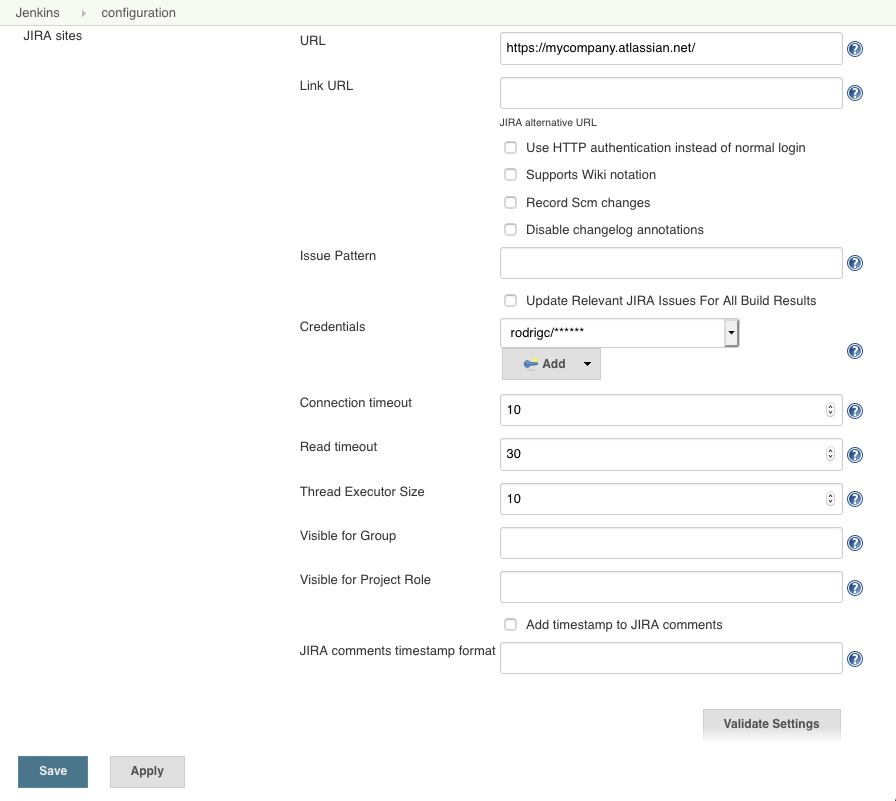
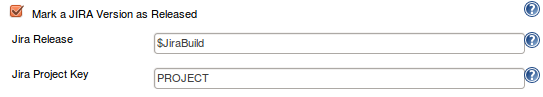

# Jenkins Jira Plugin

[](https://plugins.jenkins.io/jira)
[](https://stats.jenkins.io/pluginversions/jira.html)
[](https://github.com/jenkinsci/jira-plugin/releases/latest)
[](https://ci.jenkins.io/job/Plugins/job/jira-plugin/)
[](https://github.com/jenkinsci/jira-plugin/graphs/contributors)

## About the plugin

This plugin integrates with Jenkins the [Atlassian Jira Software](http://www.atlassian.com/software/jira/) (both Cloud and Server versions). For bug reports, see [bugs](https://issues.jenkins-ci.org/issues/?filter=14761) or [all open issues](https://issues.jenkins-ci.org/issues/?filter=14956). For documentation, see [official plugin site](https://plugins.jenkins.io/jira).

## i18n

This plugin is using [CrowdIn platform](https://jenkins.crowdin.com/jira-plugin) as the frontend to manage translations. If you would like to contribute translation of this plugin in your language,  you're most than welcome! For details, see [jenkins.io CrowdIn introduction](https://www.jenkins.io/doc/developer/crowdin/translating-plugins/).

[](https://jenkins.crowdin.com/jira-plugin)
[](https://jenkins.crowdin.com/jira-plugin)
[](https://jenkins.crowdin.com/jira-plugin)
[](https://jenkins.crowdin.com/jira-plugin)
[](https://jenkins.crowdin.com/jira-plugin)
[](https://jenkins.crowdin.com/jira-plugin)
[](https://jenkins.crowdin.com/jira-plugin)
[](https://jenkins.crowdin.com/jira-plugin)

## Compatibility

For plugin compatibility with [Pipeline plugin](https://github.com/jenkinsci/pipeline-plugin), see [COMPATIBILITY](COMPATIBILITY.md).

## Configuring the plugin

### Configuration for Jira Cloud

With Atlassian Jira Cloud, it's not possible to create a user without an email, so you need to create API token that will be used as a _service user_ by Jenkins to execute API calls to Jira Cloud - follow [Atlassian API tokens documentation](https://confluence.atlassian.com/cloud/api-tokens-938839638.html)

Then create a global Jenkins credential:

- put _Atlassian ID email_ as username
- _API token_ as password.

You can check if your API token works correctly by getting a correct JSON issue response with this command (where TEST-1 is an example issue in your project):

```bash
curl -X GET -u <email>:<API token> -H "Content-Type: application/json"  https://<YourCloudInstanceName>.atlassian.net/rest/api/latest/issue/TEST-1
```

Also make sure that CAPTCHA is not triggered for your user as this will
prevent the API token to work - see [CAPTCHA section in Atlassian REST API documentation.](https://developer.atlassian.com/cloud/jira/platform/jira-rest-api-basic-authentication/)

### System properties

- _-Dhudson.plugins.jira.JiraMailAddressResolver.disabled=true_

    Use to disable resolving user email from Jira usernames. Currently there is no option for this in UI.

### Using Jira REST API

This plugin has an optional feature to update Jira issues with a back pointer to Jenkins build pages. This allows the submitter and watchers to quickly find out which build they need to pick up to get the fix.



### Jira Issue links in build Changelog

When you configure your Jira site in Jenkins, the plugin will automatically hyperlink all matching issue names to Jira.

If you have additionally provided username/password to Jira, the hyperlinks will also contain tooltips with the issue summary.


### Updating Jira issues with back pointers

If you also want to use this feature, you need to supply a valid user id/password. If you need the comment only to be visible to a certain Jira group, e.g. _Software Development_, enter the groupname.

Now you also need to configure jobs. I figured you might not always have write access to the Jira (say you have a Jenkins build for one of the Apache commons project that you depend on), so that's why this is optional.  

The following screen shows how a Jira issue is updated:


By taking advantages of Jenkins' [fingerprint](https://wiki.jenkins.io/display/JENKINS/Fingerprint) feature, when your other projects that depend on this project pick up a build with a fix, those build numbers can also be recorded in Jira.

This is quite handy when a bug is fixed in one of the libraries, yet the submitter wants a fix in a different project. This happens often in my work, where a bug is reported against JAX-WS but the fix is in JAXB.

For curious mind, see [this thread for how this works behind the scene](http://jenkins.361315.n4.nabble.com/How-can-does-Hudson-Jira-integration-works-td374680.html).

### Referencing Jira Release version

To reference Jira Release versions in your build, you can pull these
releases directly from Jira by adding the Jira Release Version
Parameter.

This can be useful for generating release notes, trigerring
parameterized build, etc.  


### Generating Release Notes

You can also generate release notes to be used during your build. These notes can be retrieved from an environment variable. See the [Maven Project Plugin](https://wiki.jenkins.io/display/JENKINS/Maven+Project+Plugin) for
the environment variables found within the POM.  


After your build has run, you can also have the plugin mark a release as resolved. This typically will be a release you specified in your Build Parameters.  


The plugin can also move certain issues matching a JQL query to a new release version.  


Sample usage of generated Release Notes:


### Jira Authentication & Permissions required

**Note:** As a rule of thumb, **you should be always using a service account** (instead of a personal account) to integrate Jenkins with Jira.

Make sure that the Jira user used by Jenkins has enough permissions to execute its actions. You can do that via Jira Permission Helper tool.

- For creating Jira issues, the user has to be able to Create Issues in the specified project
- If you additionally enter assignee or component field values, make sure that:
      - both of the fields are assigned to the corresponding Jira Screen
      - the Jira user is Assignable in the project
      - the Jenkins Jira user can Assign issues

### Related Resources

- Check also the Marvelution [Jenkins Integration for Jira](https://www.marvelution.com/products/jenkins-integration-for-jira/) which provides a two-way solution (Jenkins-\>Jira and Jira-\>Jenkins)
- For Jira Workflow (Pipeline) plugin compatibility see [COMPATIBILITY.md](COMPATIBILITY.md)

#### Common issues

##### Jenkins<>Jira SSL connectivity problems

If you encounter stacktrace like this:

```stacktrace
Caused by: javax.net.ssl.SSLHandshakeException: sun.security.validator.ValidatorException: PKIX path building failed: sun.security.provider.certpath.SunCertPathBuilderException: unable to find valid certification path to requested target
```

make sure the JRE/JDK that Jenkins master is running (or the Jenkins slaves are running) contain the valid CA chain certificates that Jira is running with.
You can test it using this [SSLPoke.java class](https://gist.github.com/warden/e4ef13ea60f24d458405613be4ddbc51):

```sh
$ wget -O SSLPoke.java https://gist.githubusercontent.com/warden/e4ef13ea60f24d458405613be4ddbc51/raw/7f258a30be4ddea7b67239b40ae305f6a2e98e0a/SSLPoke.java

$ /usr/java/jdk1.8.0_131/bin/javac SSLPoke.java

$ /usr/java/jdk1.8.0_131/jre/bin/java SSLPoke jira.domain.com 443
Successfully connected
```

References:

- [Jenkins fails with PKIX Path building error](https://stackoverflow.com/questions/52842214/jenkins-fails-with-pkix-path-building-error)
- [PKIX path building failed error message
](https://support.cloudbees.com/hc/en-us/articles/217078498-PKIX-path-building-failed-error-message)

## Something doesn't work?

Contribute or Sponsor!

We all love Open Source, but... Open Source Software relies on contributions of fellow developers. Please contribute by [opening Pull Requests](#contributing) or if you are not a developer, consider sponsoring one of the maintainers.

### Contributing

New feature proposals and bug fix proposals should be submitted as [Pull Requests](https://help.github.com/articles/creating-a-pull-request). When adding new features please make sure that they support Jenkins Pipeline Plugin - see [COMPATIBILITY.md](https://github.com/jenkinsci/pipeline-plugin/blob/master/COMPATIBILITY.md) for more information

### Tests

There have been many developers involved in the development of this plugin and there are many downstream users who depend on it. Tests help us assure that we're delivering a reliable plugin and that we've communicated our intent to other developers in a way that they can detect when they run tests.

- each change should be covered by appropriate unit tests.
- in case it is not testable via a unit test, it should be tested against a real Jira instance - possibly both Jira Server and Jira Cloud. There is a [Jira Cloud test instance](https://jenkins-jira-plugin.atlassian.net/) that we are using for testing the plugin releases - let us know in the Pull Request in case you need access for testing.

## Maintainers

See [MAINTAINERS](MAINTAINERS.md) for some useful info.
