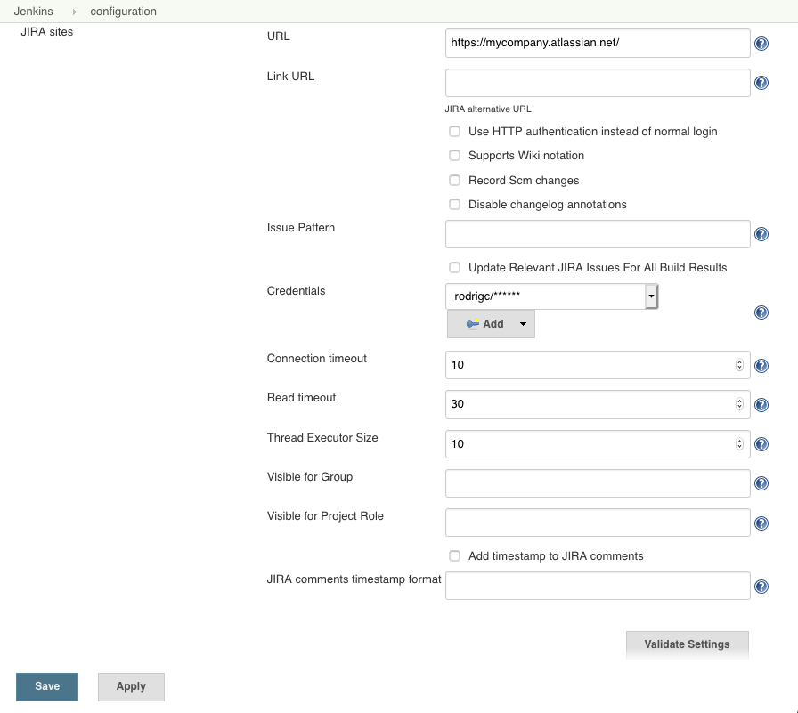

# Configuration

!> **Jira Cloud URL Configuration** — when configuring the Jira URL in Jenkins, you must use the
API endpoint format `https://api.atlassian.com/ex/jira/{cloudId}/` instead of your standard
`https://yourcompany.atlassian.net/` address. Using the standard address can trigger automated
CAPTCHA security checks, which will block Jenkins and cause the connection to fail.

## Before you start

**Always use a service account**, not a personal account, to integrate Jenkins with Jira.

The **Use Bearer authentication instead of Basic authentication** checkbox controls how the
credential's password field is sent to Jira:

- **Unchecked (Basic authentication):** the credential's username and password are sent together,
  Base64-encoded. This is what a Jira Cloud API token or a traditional Data Center/Server
  username+password login use.
- **Checked (Bearer authentication):** only the credential's password field is sent, as an
  `Authorization: Bearer <token>` header — the username field is ignored entirely. This is what a
  Jira Data Center/Server Personal Access Token uses, and also what a Jira Cloud OAuth 2.0 access
  token uses.

In short: Bearer authentication isn't a Server-only thing — it depends on the *kind of token*
you're authenticating with, not on Cloud vs. Data Center/Server.

### Required Jira permissions

Make sure the service account has enough permissions for what you'll ask it to do — check via
Jira's Permission Helper tool:

- To create Jira issues, it needs **Create Issues** on the target project.
- If you also set the assignee or component fields, make sure:
  - both fields are on the corresponding Jira screen,
  - the account is **Assignable** on the project,
  - the account can **Assign Issues**.

## Jira Cloud

To integrate Jenkins with Atlassian Jira Cloud, you need to use an API token as a _service user_.
Jira Cloud requires an email address for all users, so you cannot create a user without one.

### Using an API token (Basic authentication)

This is the common case, and works whether the Jira URL is your standard
`https://yourcompany.atlassian.net/` address or the `https://api.atlassian.com/ex/jira/{cloudId}/`
gateway form.

1. **Create an API Token**

   Follow the [Atlassian API tokens documentation](https://confluence.atlassian.com/cloud/api-tokens-938839638.html) to generate a new API token.

2. **Add a Global Jenkins Credential**

   - **Username:** Your Atlassian ID email address
   - **Password:** The API token you created
   - Leave **Use Bearer authentication** unchecked.

3. **Test Your API Token**

   Verify your API token by running the following command (replace `<email>`, `<API token>`,
   `<YourCloudInstanceName>`, and `TEST-1` with your details):

   ```bash
   curl -X GET -u <email>:<API token> -H "Content-Type: application/json" \
     https://<YourCloudInstanceName>.atlassian.net/rest/api/latest/issue/TEST-1
   ```

   A successful response returns the issue details in JSON format.

4. **Check for CAPTCHA**

   Ensure that CAPTCHA is **not** triggered for your user, as this will prevent the API token from
   working. For more information, see the
   [CAPTCHA section in Atlassian REST API documentation](https://developer.atlassian.com/cloud/jira/platform/jira-rest-api-basic-authentication/).

5. **Test Connection**

   Finally, use the **Validate Settings** button on the plugin configuration page, to see if it can
   connect to the Jira instance.

### Using an OAuth 2.0 access token (Bearer authentication)

If instead you're authenticating against the `https://api.atlassian.com/ex/jira/{cloudId}/`
gateway with an OAuth 2.0 access token (for example, one obtained by a Connect or Forge app)
rather than a classic API token:

1. **Add a Global Jenkins Credential**

   - **Username:** any value — it's ignored when Bearer authentication is used
   - **Password:** the OAuth 2.0 access token
   - Check **Use Bearer authentication instead of Basic authentication**.

2. **Test Connection**

   Use the **Validate Settings** button to confirm Jenkins can connect.



## Jira Data Center / Server

Jira Data Center/Server supports both a traditional username+password login and, since Jira 8.14,
[Personal Access Tokens (PATs)](https://confluence.atlassian.com/enterprise/using-personal-access-tokens-1026032365.html).

### Using a username and password (Basic authentication)

- **Username:** your Jira login username
- **Password:** your Jira login password
- Leave **Use Bearer authentication** unchecked.

### Using a Personal Access Token (Bearer authentication)

1. **Create a Personal Access Token** in your Jira user profile under **Personal Access Tokens**.

2. **Add a Global Jenkins Credential**

   - **Username:** any value — it's ignored when Bearer authentication is used
   - **Password:** the Personal Access Token
   - Check **Use Bearer authentication instead of Basic authentication**.

3. **Test Connection**

   Use the **Validate Settings** button to confirm Jenkins can connect.

Connection failing? See [Troubleshooting](troubleshooting.md).

## Next steps

- **[Usage Examples](usage-examples.md)** — ready-to-copy Pipeline snippets for each step.
- **[System Properties](system-properties.md)** — settings not exposed in the UI.
