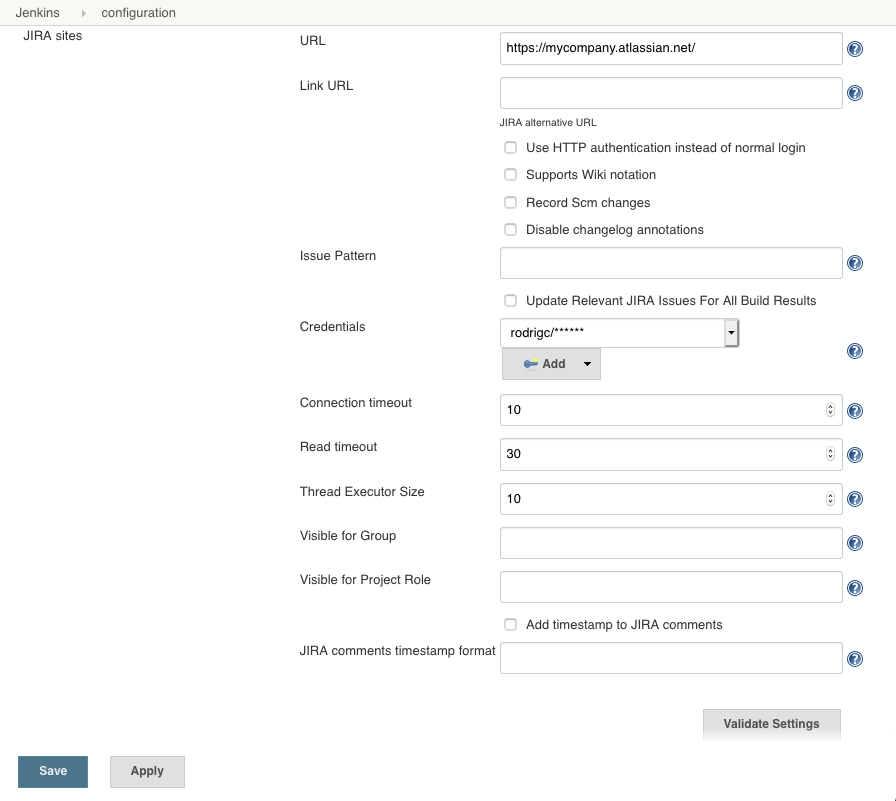
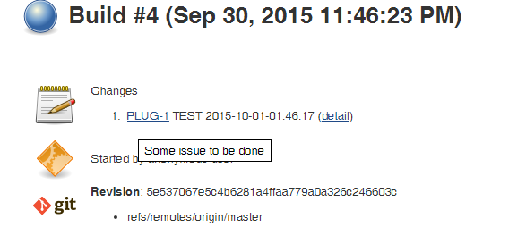
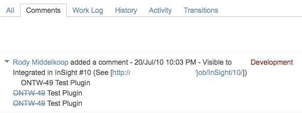
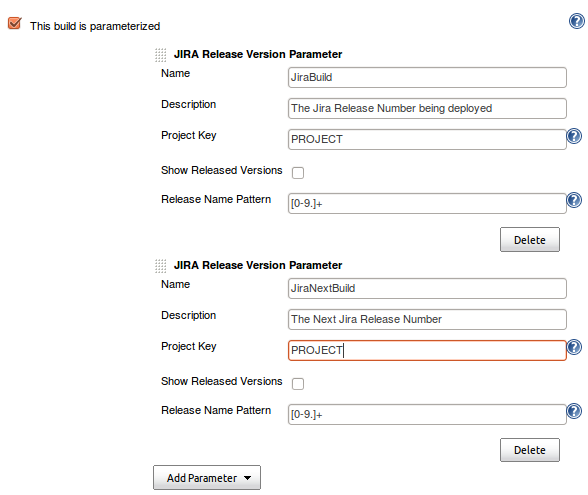
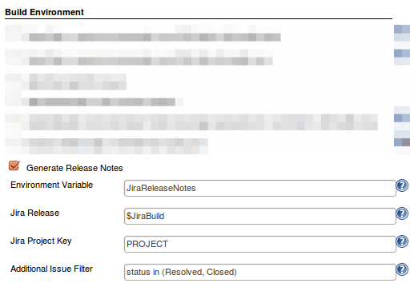
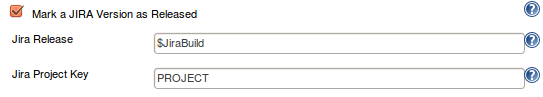
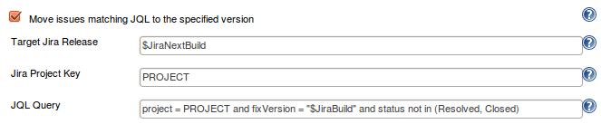
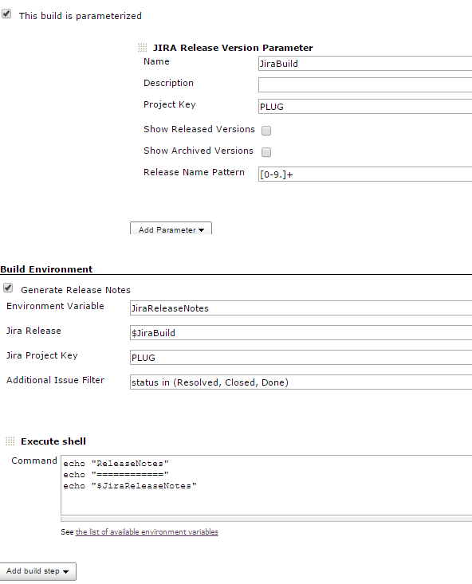

# Jenkins Jira plugin features

### Using Jira REST API

This plugin has an optional feature to update Jira issues with a back pointer to Jenkins build pages. This allows the submitter and watchers to quickly find out which build they need to pick up to get the fix.

### Jira Issue links in build Changelog

When you configure your Jira site in Jenkins, the plugin will automatically hyperlink all matching issue names to Jira.

If you have additionally provided username/password to Jira, the hyperlinks will also contain tooltips with the issue summary.

### Updating Jira issues with back pointers

If you also want to use this feature, you need to supply a valid user id/password. If you need the comment only to be visible to a certain Jira group, e.g. _Software Development_, enter the groupname.

Now you also need to configure jobs. I figured you might not always have write access to the Jira (say you have a Jenkins build for one of the Apache commons project that you depend on), so that's why this is optional.  

The following screen shows how a Jira issue is updated:

By taking advantages of Jenkins' [fingerprint](https://wiki.jenkins.io/display/JENKINS/Fingerprint) feature, when your other projects that depend on this project pick up a build with a fix, those build numbers can also be recorded in Jira.

This is quite handy when a bug is fixed in one of the libraries, yet the submitter wants a fix in a different project. This happens often in my work, where a bug is reported against JAX-WS but the fix is in JAXB.

For curious mind, see [this thread for how this works behind the scene](http://jenkins.361315.n4.nabble.com/How-can-does-Hudson-Jira-integration-works-td374680.html).

### Referencing Jira Release version

To reference Jira Release versions in your build, you can pull these
releases directly from Jira by adding the Jira Release Version
Parameter.

This can be useful for generating release notes, trigerring
parameterized build, etc.  

### Generating Release Notes

You can also generate release notes to be used during your build. These notes can be retrieved from an environment variable. See the [Maven Project Plugin](https://wiki.jenkins.io/display/JENKINS/Maven+Project+Plugin) for
the environment variables found within the POM.  

After your build has run, you can also have the plugin mark a release as resolved. This typically will be a release you specified in your Build Parameters.  

The plugin can also move certain issues matching a JQL query to a new release version.  

Sample usage of generated Release Notes:

### Jira Authentication & Permissions required

**Note:** As a rule of thumb, **you should be always using a service account** (instead of a personal account) to integrate Jenkins with Jira.

Make sure that the Jira user used by Jenkins has enough permissions to execute its actions. You can do that via Jira Permission Helper tool.

- For creating Jira issues, the user has to be able to Create Issues in the specified project
- If you additionally enter assignee or component field values, make sure that:
      - both of the fields are assigned to the corresponding Jira Screen
      - the Jira user is Assignable in the project
      - the Jenkins Jira user can Assign issues
