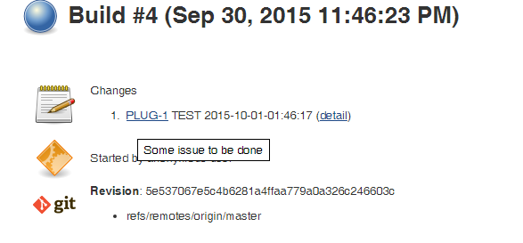
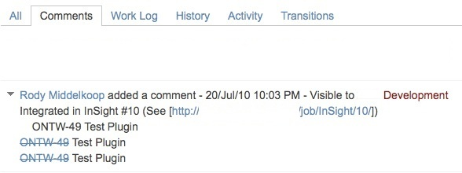
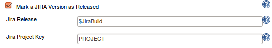
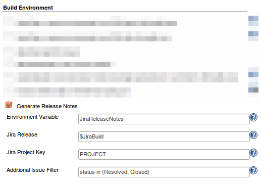
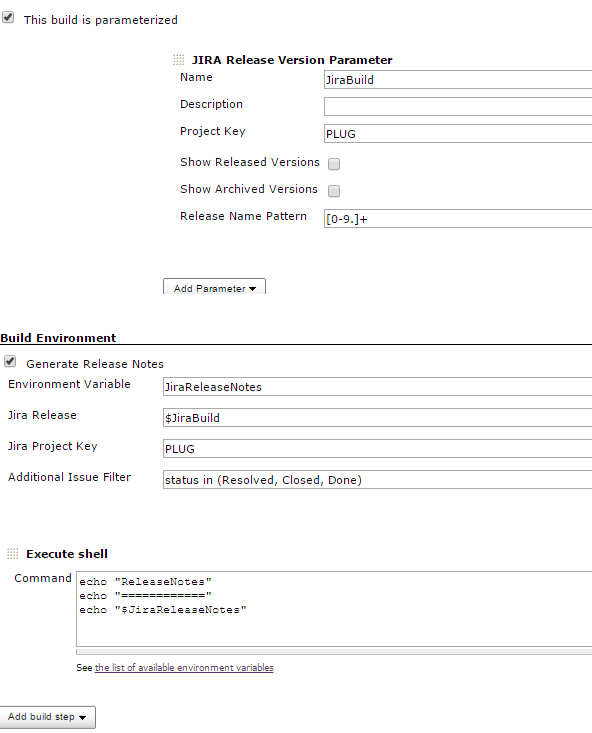
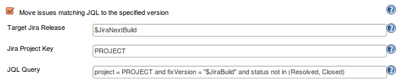
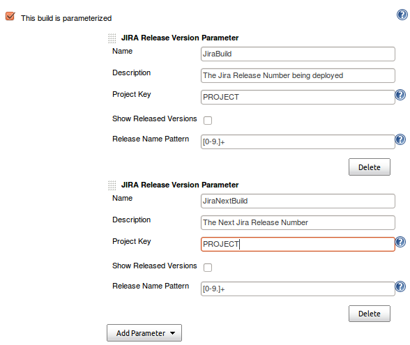

# Jenkins Jira plugin features

Once the plugin is [configured](configuration.md), here's everything it can do — one section per
feature, each with a minimal [declarative Pipeline](https://www.jenkins.io/doc/book/pipeline/syntax/)
example.

For the full parameter list of every step, see the
[jira plugin steps reference](https://www.jenkins.io/doc/pipeline/steps/jira/). That page is
generated automatically from this plugin's own source (the `@Symbol`-registered steps, their
`@DataBoundSetter` parameters, and their `help-*.html` files) every time a new version releases, so
it's always in sync with what you actually have installed — treat it as the canonical parameter
reference. The examples below aren't: they're maintained by hand and only as current as the last PR
that touched them.

## Table of contents

**Automatic**

- [Link builds back to Jira issues](#link-builds-back-to-jira-issues)

**Pipeline steps**

- [Post a comment on an issue](#post-a-comment-on-an-issue) — `jiraComment`
- [Comment on issues found in a build](#comment-on-issues-found-in-a-build) — `jiraCommentIssues`
- [Search issues by JQL](#search-issues-by-jql) — `jiraSearch`
- [Select issues with a reusable selector](#select-issues-with-a-reusable-selector) — `jiraIssueSelector`
- [Update a custom field on issues](#update-a-custom-field-on-issues) — `jiraUpdateIssueField`
- [Execute a workflow transition on issues](#execute-a-workflow-transition-on-issues) — `jiraExecuteWorkflow`
- [Create a release version](#create-a-release-version) — `jiraCreateVersion`
- [Mark a release version as released](#mark-a-release-version-as-released) — `jiraMarkVersionReleased`
- [Generate release notes](#generate-release-notes) — `jiraCreateReleaseNotes`

**Freestyle only**

- [Create an issue when a build fails](#create-an-issue-when-a-build-fails) — `JiraCreateIssueNotifier`
- [Add or migrate a fix version](#add-or-migrate-a-fix-version) — `JiraIssueMigrator`
- [Inject Jira environment variables](#inject-jira-environment-variables) — `JiraEnvironmentVariableBuilder`

**Build parameters**

- [Pick a Jira issue as a build parameter](#pick-a-jira-issue-as-a-build-parameter) — `jiraIssue`
- [Pick a release version as a build parameter](#pick-a-release-version-as-a-build-parameter) — `jiraReleaseVersion`

**Reference**

- [Issue selectors](#issue-selectors)
- [What is not yet supported in Pipeline](#what-is-not-yet-supported-in-pipeline)

## Link builds back to Jira issues

The plugin can update Jira issues with a back pointer to the Jenkins build page, so the reporter
and watchers can quickly find the build that picked up the fix.


Once a Jira site is configured, the plugin also automatically hyperlinks matching issue keys in the
build changelog — no step required. If you've additionally supplied Jira credentials, those links
get tooltips with the issue summary. This can be turned off per site with **Disable changelog
annotations**.



This also works across projects: using Jenkins' [fingerprint](https://wiki.jenkins.io/display/JENKINS/Fingerprint)
feature, when a downstream build picks up a fix, that build number is recorded on the original Jira
issue too — useful when a bug is reported against one component but fixed in a dependency.

## Post a comment on an issue

**Pipeline step:** `jiraComment`

For jobs that just want to post a single comment on a known issue, without any issue discovery:

```groovy
pipeline {
    agent any
    stages {
        stage('Notify Jira') {
            steps {
                jiraComment(
                        issueKey: 'EX-111',
                        body: "Job '${env.JOB_NAME}' (${env.BUILD_NUMBER}) built. Please go to ${env.BUILD_URL}.")
            }
        }
    }
}
```

## Comment on issues found in a build

**Pipeline step:** `jiraCommentIssues`  ·  **Freestyle:** "Update relevant Jira issues" publisher

Finds issues via an [issue selector](#issue-selectors) (by default, issue keys matched in the
changelog) and comments on each one with the build result and SCM changes. Unresolved issues carry
over to the next build automatically. To post comments back to Jira, supply a valid Jira user/API
token — this is optional, since you won't always have write access to every Jira project your build
touches (e.g. a Jenkins build for an upstream OSS dependency). If comments should only be visible to
a specific Jira group (e.g. *Software Development*), set the group name on the Jira site.



In Pipeline, unlike freestyle jobs (which read the job's own configured SCM automatically), this
step needs an explicit `scm` reference — capture the return value of the `git` step and pass it
through:

```groovy
pipeline {
    agent any
    stages {
        stage('Build and notify Jira') {
            steps {
                script {
                    def gitScm = git(url: 'git@github.com:jenkinsci/jira-plugin.git', branch: 'master')
                    sh 'make something'
                    jiraCommentIssues(
                            issueSelector: DefaultSelector(),
                            scm: gitScm,
                            labels: ['jenkins'])
                }
            }
        }
    }
}
```

## Search issues by JQL

**Pipeline step:** `jiraSearch`

Runs a JQL query directly from a Pipeline and returns the matching issue keys:

```groovy
pipeline {
    agent any
    stages {
        stage('Find issues') {
            steps {
                script {
                    def issueKeys = jiraSearch(jql: "project = EX AND labels = 'jenkins'")
                    echo "Found: ${issueKeys}"
                }
            }
        }
    }
}
```

## Select issues with a reusable selector

**Pipeline step:** `jiraIssueSelector`

Runs any configured [issue selector](#issue-selectors) — the same mechanism `jiraCommentIssues` and
`jiraUpdateIssueField` use — standalone, and returns the resulting issue keys:

```groovy
pipeline {
    agent any
    stages {
        stage('Select issues') {
            steps {
                script {
                    def issueKeys = jiraIssueSelector(issueSelector: DefaultSelector())
                    echo "Selected: ${issueKeys}"
                }
            }
        }
    }
}
```

## Update a custom field on issues

**Pipeline step:** `jiraUpdateIssueField`

Sets a custom field's value on every issue found by an issue selector. `fieldId` is the numeric
custom field ID (the `customfield_` prefix is added automatically if you leave it off):

```groovy
pipeline {
    agent any
    stages {
        stage('Update field') {
            steps {
                jiraUpdateIssueField(
                        issueSelector: ExplicitSelector('EX-111'),
                        fieldId: '10001',
                        fieldValue: 'value')
            }
        }
    }
}
```

## Execute a workflow transition on issues

**Pipeline step:** `jiraExecuteWorkflow`  ·  **Freestyle:** available as a build step too

Mass-updates every issue matching a JQL query by running a named workflow action (e.g. "Resolve
Issue") and/or adding a comment:

```groovy
pipeline {
    agent any
    stages {
        stage('Resolve issues') {
            steps {
                jiraExecuteWorkflow(
                        jqlSearch: "project = EX AND labels = 'jenkins' AND fixVersion = '${env.VERSION}'",
                        workflowActionName: 'Resolve Issue',
                        comment: 'Resolved by Jenkins')
            }
        }
    }
}
```

## Create a release version

**Pipeline step:** `jiraCreateVersion`  ·  **Freestyle:** available as a build step too

Creates a new Jira version for a project. `failIfAlreadyExists` defaults to `true`; set it to
`false` to make the step a no-op when the version already exists:

```groovy
pipeline {
    agent any
    stages {
        stage('Create version') {
            steps {
                jiraCreateVersion(
                        jiraProjectKey: 'EX',
                        jiraVersion: '1.1.1')
            }
        }
    }
}
```

?> The older `JiraVersionCreator` freestyle notifier does the same thing and is kept only for
backward compatibility — prefer `jiraCreateVersion` above for new jobs.

## Mark a release version as released

**Pipeline step:** `jiraMarkVersionReleased`  ·  **Freestyle:** available as a build step too

Marks an existing Jira version as released — typically one you picked with the
[release version build parameter](#pick-a-release-version-as-a-build-parameter):



```groovy
pipeline {
    agent any
    stages {
        stage('Release version') {
            steps {
                jiraMarkVersionReleased(
                        jiraProjectKey: 'EX',
                        jiraRelease: '1.1.1')
            }
        }
    }
}
```

?> The older `JiraReleaseVersionUpdater` freestyle notifier does the same thing and is kept only for
backward compatibility — prefer `jiraMarkVersionReleased` above for new jobs.

## Generate release notes

**Pipeline step:** `jiraCreateReleaseNotes` (a block-scoped step, wrapping the steps that use the
generated notes)  ·  **Freestyle:** available as a build wrapper too

Generates release notes text for a Jira version — issues matching `jiraFilter` (default
`status in (Resolved, Closed)`) — and exposes it as an environment variable
(`jiraEnvironmentVariable`, default `RELEASE_NOTES`) for the wrapped steps:



```groovy
pipeline {
    agent any
    stages {
        stage('Release notes') {
            steps {
                jiraCreateReleaseNotes(
                        jiraProjectKey: 'EX',
                        jiraRelease: '1.1.1',
                        jiraEnvironmentVariable: 'RELEASE_NOTES',
                        jiraFilter: 'status in (Resolved, Closed)') {
                    echo env.RELEASE_NOTES
                }
            }
        }
    }
}
```



## Create an issue when a build fails

**Freestyle only:** `JiraCreateIssueNotifier` — not available as a native Pipeline step, use the
generic `step` wrapper below.

Creates a Jira issue the first time a build fails, then comments on that same issue for each
repeated failure (instead of filing a new one) until it's closed or resolved in Jira. When the
build recovers to success, it comments again and can optionally run a workflow action
(`actionIdOnSuccess`) to close it out automatically:

```groovy
pipeline {
    agent any
    stages {
        stage('Build') {
            steps {
                sh 'make'
            }
        }
    }
    post {
        always {
            step([$class: 'JiraCreateIssueNotifier',
                  projectKey: 'EX',
                  testDescription: '',
                  assignee: '',
                  component: '',
                  typeId: null,
                  priorityId: null,
                  actionIdOnSuccess: null])
        }
    }
}
```

## Add or migrate a fix version

**Freestyle only:** `JiraIssueMigrator` — not available as a native Pipeline step, use the generic
`step` wrapper below.

Moves issues matching a JQL query into a release version: either adds `jiraRelease` as an extra fix
version (`addRelease: true`), or migrates/replaces an existing fix version on those issues
otherwise:



```groovy
pipeline {
    agent any
    stages {
        stage('Build') {
            steps {
                sh 'make'
            }
        }
    }
    post {
        success {
            step([$class: 'JiraIssueMigrator',
                  jiraProjectKey: 'EX',
                  jiraRelease: '1.1.1',
                  jiraQuery: "project = EX AND fixVersion = '1.1.0'",
                  jiraReplaceVersion: '',
                  addRelease: true])
        }
    }
}
```

## Inject Jira environment variables

**Freestyle only:** `JiraEnvironmentVariableBuilder` — not available as a native Pipeline step at
all (it's a classic `Builder`, not a `SimpleBuildStep`), but the same information is available
through other steps:

```groovy
pipeline {
    agent any
    stages {
        stage('Read Jira info') {
            steps {
                script {
                    env.JIRA_URL = hudson.plugins.jira.JiraSite.get(currentBuild.rawBuild).name

                    def issueKeys = jiraIssueSelector()
                    env.JIRA_ISSUES = issueKeys.join(',')
                    env.JIRA_ISSUES_SIZE = "${issueKeys.size()}"
                }
            }
        }
    }
}
```

Pass a specific selector to `jiraIssueSelector(issueSelector: ...)` the same way you would to
[`jiraCommentIssues`](#comment-on-issues-found-in-a-build) if you don't want the default one.

## Pick a Jira issue as a build parameter

**Pipeline parameter:** `jiraIssue`  ·  **Freestyle:** available as a build parameter too

Presents a dropdown of Jira issues matching a JQL filter, letting whoever starts the build pick one:

```groovy
pipeline {
    agent any
    parameters {
        jiraIssue(
                name: 'ISSUE',
                description: 'Pick the Jira issue this build is for',
                jiraIssueFilter: 'project = EX AND status = Open')
    }
    stages {
        stage('Build') {
            steps {
                echo "Building for ${params.ISSUE}"
            }
        }
    }
}
```

`altSummaryFields` (a comma-separated list of custom field names) can be set on the parameter
definition to build the dropdown label from those fields instead of the issue summary.

## Pick a release version as a build parameter

**Pipeline parameter:** `jiraReleaseVersion`  ·  **Freestyle:** available as a build parameter too

Presents a dropdown of Jira versions for a project — handy for generating release notes or feeding
into [`jiraMarkVersionReleased`](#mark-a-release-version-as-released). Filter it with
`jiraReleasePattern` (a regex) and the `jiraShow*` flags:



```groovy
pipeline {
    agent any
    parameters {
        jiraReleaseVersion(
                name: 'RELEASE',
                description: 'Pick the Jira release version to build',
                jiraProjectKey: 'EX',
                jiraReleasePattern: '',
                jiraShowReleased: 'false',
                jiraShowArchived: 'false',
                jiraShowUnreleased: 'true')
    }
    stages {
        stage('Build') {
            steps {
                echo "Releasing ${params.RELEASE}"
            }
        }
    }
}
```

## Issue selectors

Several steps above take an `issueSelector:` argument that decides *which* issues they act on:

- **`DefaultSelector()`** — the default. Combines issues carried over from a previous failed
  attempt, issue keys matched in the changelog, issues from a
  [`jiraIssue` build parameter](#pick-a-jira-issue-as-a-build-parameter), and issues found the same
  way in upstream dependency builds.
- **`ExplicitSelector('EX-1,EX-2')`** — an explicit, comma-separated list of issue keys (supports
  environment variable expansion).
- **`JqlSelector('project = EX AND status = Open')`** — runs a JQL query.
- **`P4Selector()`** — reads Perforce job IDs from the changelog instead of scanning for issue-key
  patterns. Requires the P4 plugin to be also installed.

## What is not yet supported in Pipeline

Notifiers in general aren't implemented as native Pipeline steps: a running flow has no build status
yet (unlike a freestyle project, whose status is known before its notifier runs), so there's nothing
meaningful for a notifier to react to. That's why
[Create an issue when a build fails](#create-an-issue-when-a-build-fails) and
[Add or migrate a fix version](#add-or-migrate-a-fix-version) above use the generic `step`/`post`
wrapper instead of a native step. Use the `catchError` step around your build if you need to capture
a build's outcome before calling one of these manually.

If you're adding a new feature to the plugin, make sure it also works as a Pipeline step — see the
workflow plugin's [compatibility notes](https://github.com/jenkinsci/workflow-plugin/blob/master/COMPATIBILITY.md)
and [core steps reference](https://github.com/jenkinsci/workflow-plugin/blob/master/basic-steps/CORE-STEPS.md).
